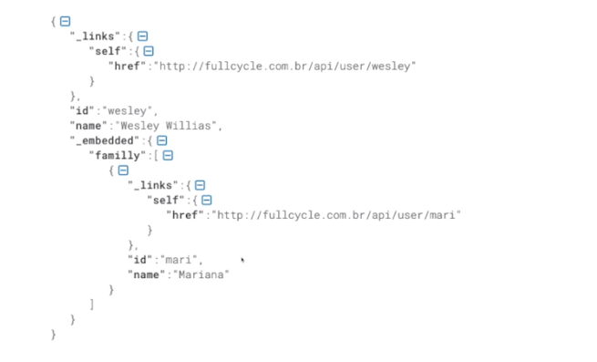

[⬅ voltar ao menu](../README.md)

# Comunicação entre sistemas 🔄

## REST (Representational state of transfer)

- simplicidade
- stateless
- cacheável

### Níveis de maturidade

#### Nivel 0

- Tudo que se traféga por http é realizado através de uma transação

#### Nivel 1: Utilização de resouces

| Verbo  | URI         | Operação |
| ------ | ----------- | -------- |
| GET    | /products/1 | Buscar   |
| POST   | /products   | Inserir  |
| PUT    | /products/1 | Alterar  |
| DELETE | /products/1 | Remover  |

#### Nível 2: Verbos HTTP

| Verbo  | Utilização           |
| ------ | -------------------- |
| GET    | Recuperar informação |
| POST   | Inserir              |
| PUT    | Alterar              |
| DELETE | Remover              |

#### Nível 3: HATEOAS (Hypermedia as the Engine of Application State)

- Sempre vai responder a requisição trazendo as ações permitidas ao usuário

```json
{
  "account": {
    "account_number": 12345,
    "balance": {
      "currency": "usd",
      "value": 100
    },
    "links": {
      "deposit": "/accounts/12345/deposit",
      "withdraw": "/accounts/12345/withdraw",
      "transfer": "/accounts/12345/transfer",
      "close": "/accounts/12345/close"
    }
  }
}
```

### Um boa API REST

- Utiliza URIs únicas para serviços e itens que expostos para esses serviços
- Utiliza todos os verbos HTTP para realizar as operações
- Provê links relacionais para os recursos exemplificando o que pode ser feito

### Principais padrões de API REST

- JSON
- Hal
- Siren

#### JSON

- Não provê um padrão de hipermídia para realizar a linkagem

#### HAL (Hypermedia Application Language)



### HTTP Method Negotiation

- O Método options informa quais metodos são permitidos para um recurso

### HTTP Content Negotiation

- Cliente solicita a informação e eo tipo de retorno pelo server baseado no media type informado por ordem de prioridade
  - Erro 406: Not Acceptable
- Através do content-type no header da request, o servidor consegue verificar se ele irá conseguir processar a informação para retornar a informação desejada
  - Erro 415: Unsupported Media Type

## GraphQL

- É uma linguagem de consulta para APIs, desenvolvida pelo Facebook, que permite aos clientes requisitar apenas os dados necessários e em formato específico.
- Em vez de ter múltiplas requisições REST para diferentes endpoints, o GraphQL utiliza um único endpoint. Os clientes especificam os campos e suas relações na query, obtendo exatamente o que precisam.

### Tipos de Dados:

- Query: Define as operações de leitura. É o ponto de entrada para buscar informações.
- Mutation: Utilizado para operações de escrita, como criação, atualização e exclusão de dados.
- Subscription: Permite que os clientes recebam atualizações em tempo real quando os dados mudam.

### Campos e Resolvers:

Os tipos de dados definidos em um schema GraphQL possuem campos que podem ser consultados. Cada campo tem um resolver, que define como os dados são buscados e retornados.

### Schema:

O schema define os tipos de dados disponíveis e suas relações. Ele atua como um contrato entre o servidor e o cliente, especificando como as queries podem ser feitas.

### Vantagens:

- Redução de over-fetching (buscar mais dados do que necessário) e under-fetching (não obter dados suficientes).
- Flexibilidade para os clientes escolherem os campos necessários.
- Possibilidade de consolidar múltiplas requisições em uma única query.
- Evolução do schema sem quebrar os clientes existentes.

### Comparação com REST:

- REST tem endpoints fixos para recursos específicos.
- GraphQL tem um único endpoint e permite que os clientes definam a estrutura da resposta.
- REST pode levar a over-fetching e under-fetching.
- GraphQL oferece maior controle sobre os dados buscados.

### Ferramentas e Bibliotecas:

Existem diversas ferramentas e bibliotecas para trabalhar com GraphQL, como Apollo Server, Relay, GraphQL Yoga, entre outras.

## gRPC

- É um framework de código aberto desenvolvido pelo Google que facilita a comunicação entre serviços distribuídos
- Utiliza o Protocol Buffers (protobuf) como formato de serialização e oferece suporte a múltiplas linguagens de programação
- Permite que diferentes serviços se comuniquem de maneira eficiente, usando um mecanismo cliente-servidor baseado em chamadas de procedimento remoto (RPC).
- Os serviços gRPC são definidos em arquivos `.proto`, onde são especificados os tipos de mensagens, métodos RPC e suas assinaturas.

### Protocol Buffers (protobuf):

É um formato de serialização binária leve e eficiente desenvolvido pelo Google. Ele é usado para definir a estrutura dos dados e as mensagens que são transmitidas entre os serviços gRPC.

### Tipos de Serviços:

- Unary RPC: Uma única requisição do cliente e uma resposta do servidor.
- Server Streaming RPC: O cliente envia uma requisição e o servidor retorna uma sequência de respostas.
- Client Streaming RPC: O cliente envia uma sequência de requisições e o servidor retorna uma única resposta.
- Bidirectional Streaming RPC: Tanto o cliente quanto o servidor enviam uma sequência contínua de mensagens.

### Benefícios do gRPC:

- Alta performance devido à serialização eficiente e multiplexação de conexões.
- Facilita a geração de código em diferentes linguagens a partir da definição do serviço.
- Suporte a autenticação, segurança e balanceamento de carga.
- Uso eficiente de recursos, adequado para microserviços e sistemas distribuídos.

### Comparação com REST:

- REST usa requisições HTTP com métodos (GET, POST, etc.).
- gRPC usa chamadas RPC para comunicação eficiente e flexível.
- gRPC possui tipagem forte e estrutura de mensagens definidas.
  
### Ferramentas e Bibliotecas:

Existem bibliotecas gRPC para várias linguagens de programação, como gRPC-Java, gRPC-Go, gRPC-Python, entre outras.
