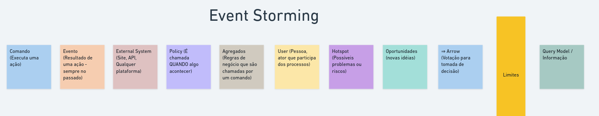

[⬅ voltar ao menu](../README.md)

# Event Storming na Prática 📅

## O Que é Event Storming?

Event Storming é uma técnica criada por Alberto Brandolini para compreender claramente o domínio de uma aplicação. Ela auxilia na modelagem de aplicações grandes e projetos complexos, proporcionando uma visão mais nítida do funcionamento da aplicação.

## Formato de Workshop

O Event Storming é conduzido como um workshop interativo, não uma abordagem estática. Isso permite a colaboração entre desenvolvedores e domain experts para esclarecer o domínio e os processos da aplicação.

## Desafios de Comunicação

O Event Storming aborda o desafio de comunicação entre desenvolvedores e domain experts. Muitas vezes, os processos cotidianos não são detalhados o suficiente, resultando em zonas cinzentas e conflitos de contexto. O workshop esclarece essas ambiguidades.

## Exploração Dinâmica

A principal vantagem do Event Storming é a exploração dinâmica. Durante o workshop, os participantes revisam e ajustam conceitos, resultando em uma compreensão consolidada do sistema. Isso contrasta com entrevistas estáticas que podem gerar ruídos e resultados insatisfatórios.

## Abordagem Interativa com Post-its

O Event Storming utiliza post-its para promover interatividade. A técnica é frequentemente realizada em uma lousa ou parede espaçosa, onde todos podem contribuir. As cores dos post-its representam diferentes elementos e conceitos.

# Cores no Event Storming

O Event Storming utiliza cores distintas para representar diferentes conceitos durante a modelagem. Cada cor tem um significado específico, facilitando a compreensão e a visualização dos eventos, comandos e agregados no processo.

## Significados das Cores

1. **Laranja:** Representa os **Eventos de Domínio**. Esses eventos são acontecimentos relevantes dentro do processo e geralmente refletem mudanças de estado ou situações importantes.

2. **Azul:** Indica os **Comandos** que são executados no processo. Os comandos são ações realizadas por agentes externos ou internos, que geralmente desencadeiam eventos.

3. **Amarelo:** É usado para identificar um **user**, sendo uma pessoa que participa dos procesos

4. **Marrom:** Representa **Agregados**. Um agregado é um conjunto de eventos e entidades relacionadas que são tratados como uma única unidade lógica dentro do domínio.

5. **Roxo claro:** É usado para identificar **Políticas** e **Restrições** de negócios. Essas são regras que orientam as ações e decisões dos agentes no processo.

6. **Roxo forte:** É usado para identificar **Hostpots**, que são possíveis problemas ou riscos

7. **Verde claro:** Representa **oportunidades** e **novas ideias**

