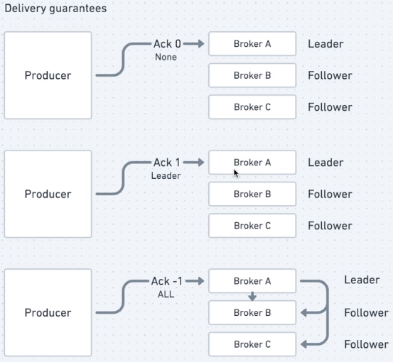

[⬅ voltar ao menu](../README.md)

# Arquitetura baseada em microsserviços 🔬

## Caracteristicas

- Aplicações comuns
- Objetivos bem definidos
- faz parte de um ecossistema
- são independentes ou autônomos
- se comunicam o tempo todo

## Principais diferenças entre microsserviços e monotilicos

- microsserviços tem dominios mais definidos
- em sistemas com microsserviços, é possivel ter muitas linguagens de programação
- o deploy é menos arriscado em microsserviços

## 9 caracteristicas sobre microsserviçis por Martin Folwer

1. Componentização
2. Capacidade de negócio
3. Produtos e não projetos
4. Smart endpoints e Dumb Pipes
5. Governança descentralizada
6. Descentralização do gerenciamento de dados
7. Automação da infraestrutura
8. Desenhado para falhar
9. Design evolutivo

## Resiliência

- É um conjunto de estrategias adotadas para a adaptação de um sistema quando uma falha ocorre

### Estratégias

- **Proteger e ser protegido**
  - Adotar mecanismos de autropreservação para grarantir ao máximo sua operação com qualidade
  - Não fazer requisições para um sistema que está falhando
- **Health check**
  - Verificação da saúde do sistema
  - Um sistema que não está saudável pode se recuperar caso o tráfego pare de ser redirecionado para ele temporariamente
- **Rate Limiting**
  - Protege o sistema baseado no que ele foi projetado para suportar
  - Preferência programada por tipo de client
- **Circuit breaker**
  - Protege o sistema fazendo que as requisições feitas para ele sejam negadas
  - Circuito fechado: requisições chegam normalmente
  - Circuito aberto: requisições não chegam ao sistema. Erro instantâneo
  - Circuito meio aberto: quantidade limitada de requisições
- **API Gateway**
  - Garante que requisições inapropriadas cheguem até o sistema
- **Service Mesh**
  - Controla o tráfego de rede
  - mTLS
- **Trabalhar de forma assíncrona**
  - Não mandar as requisições diretamente para o servidor
  - Evita perda de dados
  - Os dados podem ser processados depois
- **Retry**
  - Políticas de retry consistem em reenviar uma mensagem ou requisição se a resposta não for recebida em um determinado tempo.
- **Garantias de entrega**
  - 
- **Situações complexas**
  - O que acontece se o message broker cair?
  - Haverá perda de mensagens?
  - Seu sistema ficará fora do ar?
  - Como garantir resiliência?
- **Transactional outbox**
  - Armazenar a mensagem que iria para o kafka em uma tabela do banco de dados
  - Após o kafka confirmar o recebimento da mensagem, o registro da tabela pode ser apagado
  - | messageID | key | Topic | Payload |
- **Garantias de recebimento**
  - Ferramentas de message broker podem apagar mensagem somente após confirmação de recebimento de menssagem
- **Idempotência** 
  - O ato de conseguir lidar com mensagem duplicadas
- **Observabilidade**
  - Métricas de performance do sistema
  - APM
  - Tracing distribuído
  - Métricas personalizadas
  - Spans personalizados