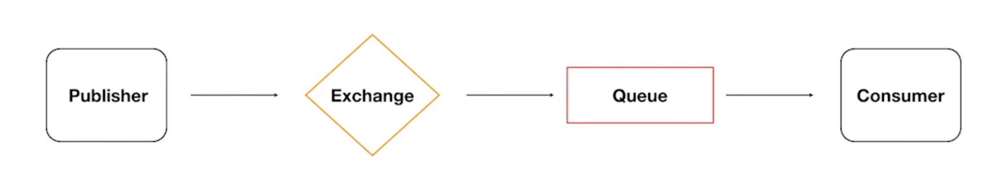
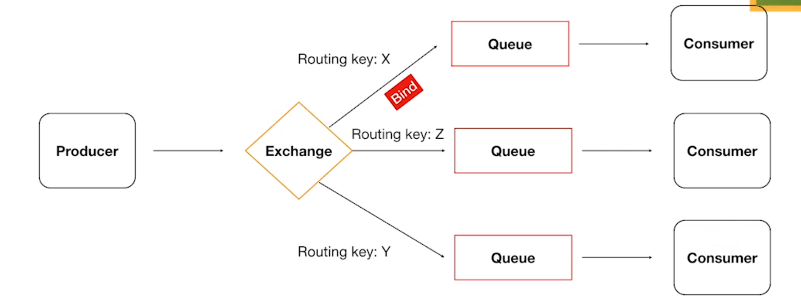
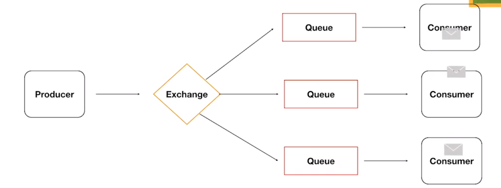
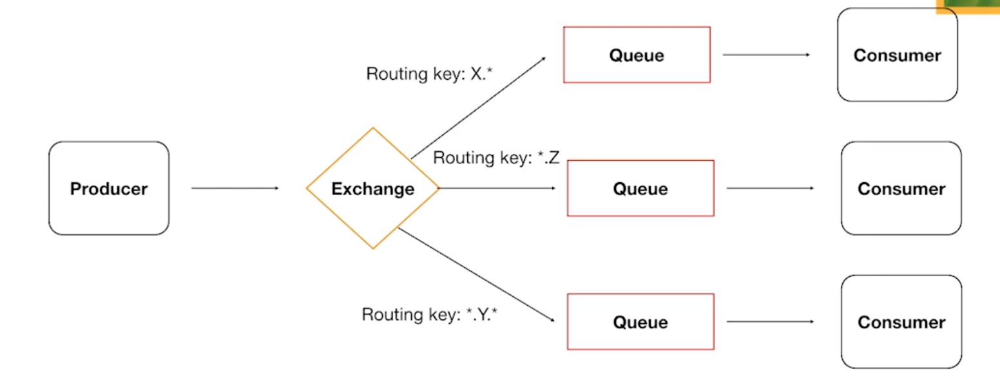

[⬅ voltar ao menu](../README.md)

# RabbitMQ 🐇

- É um software de mensageria open-source.
- Atua como um intermediário entre aplicativos para permitir a comunicação assíncrona.

## Principais Conceitos

- **Produtores (Producers)**: Aplicativos que enviam mensagens para o RabbitMQ.
- **Fila (Queue)**: Onde as mensagens são armazenadas antes de serem consumidas.
- **Consumidores (Consumers)**: Aplicativos que recebem e processam mensagens da fila.

## Benefícios

- **Escalabilidade**: Permite distribuir tarefas em vários consumidores.
- **Flexibilidade**: Suporta diversos padrões de mensageria.
- **Confiabilidade**: Garante a entrega de mensagens, mesmo em caso de falhas.

## Protocolos

- Usa o protocolo AMQP (Advanced Message Queuing Protocol) por padrão.
- Suporta outros protocolos como MQTT e STOMP.

## Exchanges

- Define as regras para roteamento de mensagens para filas.
- Tipos comuns de exchanges incluem `direct`, `topic`, e `fanout`.

### Direct Exchange

## Fanout Exchange

## Topic Exchange

## Casos de Uso

- Processamento de tarefas em segundo plano.
- Comunicação entre microserviços.
- Integração de sistemas heterogêneos.

## Queues

- **FIFO** - First In, First Out
- **Propriedades**:
  - **Durable**: Se ela deve ser salva mesmo depois do restart do broker
  - **Auto-delete**: Removida automaticamente quando o consumer se desconecta
  - **Expiry**: Define o tempo que há mensagens ou clientes consumindo
  - **Message TTL**: Tempo de vida da mensagem
  - **Overflow**:
    - Drop Head (remove a última)
    - Reject Publish
  - **Exclusive**: Somente channel que criou pode acessar
  - **Max Lenght** ou **bytes**: Quantidade de mensagens ou tamanho de bytes máximos permitidos

## Dead Letter queues

- Algumas mensagens não conseguem ser entregues por qualquer motivo
- São encaminhadas para uma exchange específica que roteia as mensagens para uma dead letter queue
- Tais mensagens podem ser consumidas e averiguadas posteriormente

## Lazy Queues

- Mensagens são armazenadas em disco
- Existe alto I/O
- Quando há milhões de mensagens em uma fila, por qualquer motivo, há a possibilidade de liberar a memória, jogando especificamente as mensagens da fila em questão em disco
